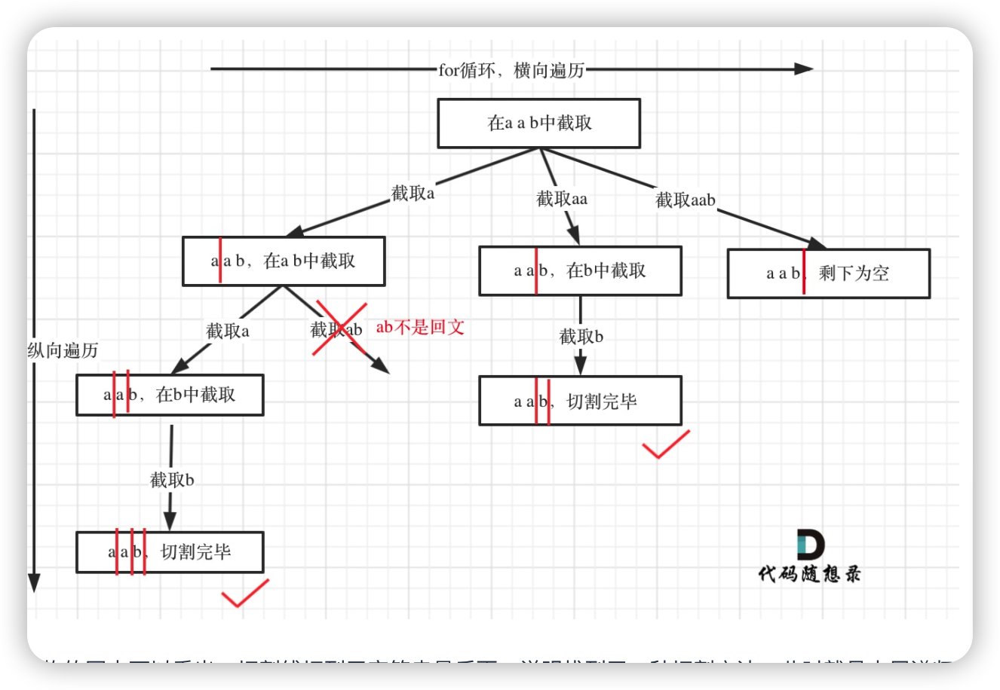

# 判断是否是回文

给你一个字符串 s，请你将 s 分割成一些子串，使每个子串都是 回文串 。返回 s 所有可能的分割方案。

回文串 是正着读和反着读都一样的字符串。



**实际上就是切割线组合，判断切割线之前的字符是不是回文串**

``` js

/**
 * @param {string} s
 * @return {string[][]}
 */
const isPalirom = function(str) {
    let left = 0
    let right = str.length - 1
    while(left < right) {
        if (str[left] !== str[right]) return false
        left++;
        right--;
    }
    return true
}

var partition = function(s) {
    let res = []
    const dfs = function(start, path) {
        if (start == s.length) res.push(path.slice())
        for (let i = start; i < s.length; i++) {
            if (!isPalirom(s.slice(start, i + 1))) continue
            path.push(s.slice(start, i + 1))
            dfs(i + 1, path)
            path.pop()
        }
    }
    dfs(0, [])
    return res
};
```


