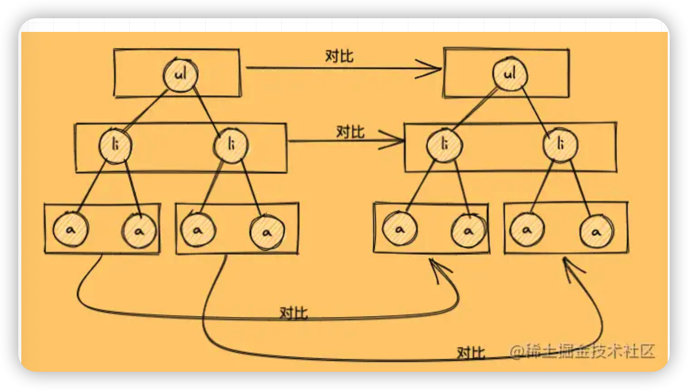

# vue diff算法


## why? 为什么要使用diff算法

1. 为了更加高效的遍历节点，对比旧虚拟DOM和新虚拟DOM,找出两者的异同，实现精准的更新真实DOM， 从而提高效率
2. 总损耗 = 虚拟DOM增删改+ （Diff算法效率） + 真实DOM增删改 + 较少节点回流与重绘
3. 直接操作真实DOM的损耗计算 总损耗 = 真实DOM完全增删改+（可能较多的节点）排版与重绘

## Diff算法的原理

1. Diff的同层对比， Diff 算法只会在同层级进行


2. Diff对比流程

- 当数据改变时，触发setter，由Dep 发布给订阅者，触发patch函数
- patch函数判断是否是同一节点：是（继续进行子节点的深层比较）否（直接替换）
- 是：进行深层patchVnode比较

``` js 
// patch
function patch(oldVnode, newVnode) {
  // 比较是否为一个类型的节点
  if (sameVnode(oldVnode, newVnode)) {
    // 是：继续进行深层比较
    patchVnode(oldVnode, newVnode)
  } else {
    // 否
    const oldEl = oldVnode.el // 旧虚拟节点的真实DOM节点
    const parentEle = api.parentNode(oldEl) // 获取父节点
    createEle(newVnode) // 创建新虚拟节点对应的真实DOM节点
    if (parentEle !== null) {
      api.insertBefore(parentEle, vnode.el, api.nextSibling(oEl)) // 将新元素添加进父元素
      api.removeChild(parentEle, oldVnode.el)  // 移除以前的旧元素节点
      // 设置null，释放内存
      oldVnode = null
    }
  }

  return newVnode
}
```


``` js
// sameVode判断是否为同一类型的节点
function sameVnode(oldVnode, newVnode) {
  return (
    oldVnode.key === newVnode.key && // key值是否一样
    oldVnode.tagName === newVnode.tagName && // 标签名是否一样
    oldVnode.isComment === newVnode.isComment && // 是否都为注释节点
    isDef(oldVnode.data) === isDef(newVnode.data) && // 是否都定义了data
    sameInputType(oldVnode, newVnode) // 当标签为input时，type必须是否相同
  )
}
```


``` js
// patchVode
function patchVnode(oldVnode, newVnode) {
  const el = newVnode.el = oldVnode.el // 获取真实DOM对象
  // 获取新旧虚拟节点的子节点数组
  const oldCh = oldVnode.children, newCh = newVnode.children
  // 如果新旧虚拟节点是同一个对象，则终止
  if (oldVnode === newVnode) return
  // 如果新旧虚拟节点是文本节点，且文本不一样
  if (oldVnode.text !== null && newVnode.text !== null && oldVnode.text !== newVnode.text) {
    // 则直接将真实DOM中文本更新为新虚拟节点的文本
    api.setTextContent(el, newVnode.text)
  } else {
    // 否则

    if (oldCh && newCh && oldCh !== newCh) {
      // 新旧虚拟节点都有子节点，且子节点不一样

      // 对比子节点，并更新
      updateChildren(el, oldCh, newCh)
    } else if (newCh) {
      // 新虚拟节点有子节点，旧虚拟节点没有

      // 创建新虚拟节点的子节点，并更新到真实DOM上去
      createEle(newVnode)
    } else if (oldCh) {
      // 旧虚拟节点有子节点，新虚拟节点没有

      //直接删除真实DOM里对应的子节点
      api.removeChild(el)
    }
  }
}
```

### patchVnode 做了这么几件事：

1. 找到对应的真实DOM，称为el
2. 判断newVnode和oldVnode是否指向同一个对象，如果是，那么直接return
3. 如果他们都有文本节点并且不相等，那么将el的文本节点设置为newVnode的文本节点。
4. 如果oldVnode有子节点而newVnode没有，则删除el的子节点
5. 如果oldVnode没有子节点而newVnode有，则将newVnode的子节点真实化之后添加到el
6. 如果两者都有子节点，则执行updateChildren函数比较子节点，这一步很重要

### updateChildre

对比子节点并且更新，并且

1. oldS 和 newS 使用sameVnode方法进行比较，sameVnode(oldS, newS)
2. oldS 和 newE 使用sameVnode方法进行比较，sameVnode(oldS, newE)
3. oldE 和 newS 使用sameVnode方法进行比较，sameVnode(oldE, newS)
4. oldE 和 newE 使用sameVnode方法进行比较，sameVnode(oldE, newE)
5. 如果以上逻辑都匹配不到，再把所有旧子节点的 key 做一个映射到旧节点下标的 key -> index 表，然后用新 vnode 的 key 去找出在旧节点中可以复用的位置。


``` js
// updateChildren  首尾指针法
function updateChildren(parentElm, oldCh, newCh) {
    // 新旧起始索引
  let oldStartIdx = 0, newStartIdx = 0
//   旧结束索引
  let oldEndIdx = oldCh.length - 1
//   旧起始节点
  let oldStartVnode = oldCh[0]
//   旧结束节点
  let oldEndVnode = oldCh[oldEndIdx]
//   新结束索引
  let newEndIdx = newCh.length - 1
//   新起始节点
  let newStartVnode = newCh[0]
//   新结束节点
  let newEndVnode = newCh[newEndIdx]
//   旧 key到索引的映射
  let oldKeyToIdx
//   
  let idxInOld
  let elmToMove
  let before
//   旧起始索引小于等于新结束索引 且 新起始索引小于等于新结束索引 循环
  while (oldStartIdx <= oldEndIdx && newStartIdx <= newEndIdx) {
    // 旧起始节点不存在
    if (oldStartVnode == null) {
        // 起始索引+1
      oldStartVnode = oldCh[++oldStartIdx]
    } else if (oldEndVnode == null) {
    // 旧结束节点不存在
        // 结束索引-1
      oldEndVnode = oldCh[--oldEndIdx]
    } else if (newStartVnode == null) {
    // 新起始节点不存在
    // 起始节点索引+1
      newStartVnode = newCh[++newStartIdx]
    } else if (newEndVnode == null) {
    // 新结束节点不存在
    // 结束索引-1
      newEndVnode = newCh[--newEndIdx]
    } else if (sameVnode(oldStartVnode, newStartVnode)) {
    // 新旧节点起始同一节点
      patchVnode(oldStartVnode, newStartVnode)
    //   索引同时+1
      oldStartVnode = oldCh[++oldStartIdx]
      newStartVnode = newCh[++newStartIdx]
    } else if (sameVnode(oldEndVnode, newEndVnode)) {
        // 新旧结束节点统一节点
        // 递归patch他们的Vnode
      patchVnode(oldEndVnode, newEndVnode)
        // 索引同时减一
      oldEndVnode = oldCh[--oldEndIdx]
      newEndVnode = newCh[--newEndIdx]
    } else if (sameVnode(oldStartVnode, newEndVnode)) {
        // 如果旧起始 = 新结束
        // patch 两个节点
      patchVnode(oldStartVnode, newEndVnode)
    //   把旧节点移动到旧节点的结束位置后一位
      api.insertBefore(parentElm, oldStartVnode.el, api.nextSibling(oldEndVnode.el))
    //   旧起始索引+1 新结束索引-1
      oldStartVnode = oldCh[++oldStartIdx]
      newEndVnode = newCh[--newEndIdx]
    } else if (sameVnode(oldEndVnode, newStartVnode)) {
    // 如果旧结束节点等于新的起始节点
      patchVnode(oldEndVnode, newStartVnode)
      api.insertBefore(parentElm, oldEndVnode.el, oldStartVnode.el)
    //   旧的结束节点 插入到旧起始节点
      oldEndVnode = oldCh[--oldEndIdx]
      newStartVnode = newCh[++newStartIdx]
    } else {
      // 4种情况全都不匹配，使用key时的比较
      if (oldKeyToIdx === undefined) {
        oldKeyToIdx = createKeyToOldIdx(oldCh, oldStartIdx, oldEndIdx) // 有key生成index表
      }
    //   获取新的节点在旧节点中的索引
      idxInOld = oldKeyToIdx[newStartVnode.key]

      if (!idxInOld) {
        // 不存在：创建插入到旧的起始之前
        api.insertBefore(parentElm, createEle(newStartVnode).el, oldStartVnode.el)

        newStartVnode = newCh[++newStartIdx]
      }
      else {
        // 存在
        // 获取需要移动位置的旧的元素
        elmToMove = oldCh[idxInOld]
        if (elmToMove.sel !== newStartVnode.sel) {
            // 如果旧的元素的位置不等于新的元素的位置
            // 创建并插入到最前
          api.insertBefore(parentElm, createEle(newStartVnode).el, oldStartVnode.el)
        } else {
            // 如果相等，继续patchVode这两个元素
          patchVnode(elmToMove, newStartVnode) 
          oldCh[idxInOld] = null
          把旧元素删除
          api.insertBefore(parentElm, elmToMove.el, oldStartVnode.el)
          把旧元素插入到最前
        }
        // 新索引 + 1
        newStartVnode = newCh[++newStartIdx]
      }
    }
  }
  if (oldStartIdx > oldEndIdx) {
    before = newCh[newEndIdx + 1] == null ? null : newCh[newEndIdx + 1].el
    // 如果旧起始索引大于新的索引，说明增加了元素的数量，需要添加vnode并且插入到对应位置
    addVnodes(parentElm, before, newCh, newStartIdx, newEndIdx)
  } else if (newStartIdx > newEndIdx) {
    //   如果新的索引大于就的索引 说明减少了元素，移除对应元素
    removeVnodes(parentElm, oldCh, oldStartIdx, oldEndIdx)
  }
}
```


## 为什么不要用用index做key

由于diff算法的存在，用index做key 可能会导致原来相同的diff 算法进行不必要的更新


